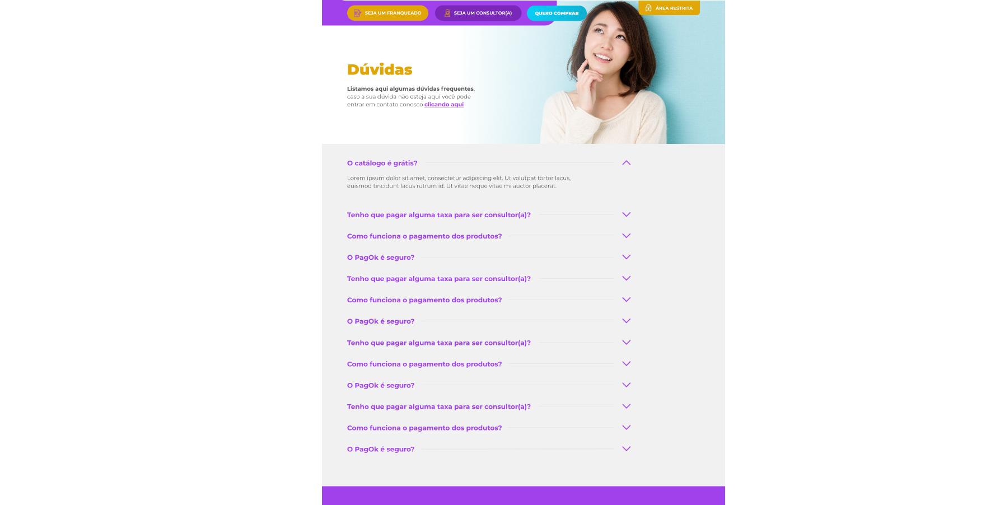

<div align="center">
  <h1> Sac Page </h1>
  <p>🏆 App for Customer Service. 🏆</p>
  <p>
    
    <a href="https://www.linkedin.com/in/gustavo-castilho-914a621b4/" target="_blank" rel="noopener noreferrer">
      
    </a>          
  </p>
</div>

<h2>Proposal 🔥</h2>


<h2> Technologies 🚀 </h2>
<li><a href="https://reactnative.dev/">ReactJS</a></li>
<li><a href="https://www.typescriptlang.org/">TypeScript</a></li>
<li><a href="https://styled-components.com/">Styled Components</a></li>
<li><a href="https://jestjs.io/pt-BR/">Jest</a></li>
<li><a href="https://testing-library.com/docs/react-testing-library/intro/">React Testing Library</a></li>
<li><a href="https://storybook.js.org/">Storybook</a></li>

<h2> Software Requirements 🔍</h2>

<li><a href="https://yarnpkg.com/">Install Yarn</a></li>
<li><a href="https://nodejs.org/en/">Install NodeJs</a></li>

<h2> Installing and running the project 🎲</h2>

```bash
# Clone este repositório
$ git clone https://github.com/GusttavoCastilho/sac_page

# Acesse a pasta do projeto no seu terminal/cmd
$ cd sac_page

# Instale as dependências
$ yarn install

# Inicie o Servidor
$ yarn start

```
<br />
<hr />
<p align=center>Made with 💜 by <a href="https://www.linkedin.com/in/gustavo-castilho-914a621b4/">Gustavo Castilho Valenciano</a><p>

